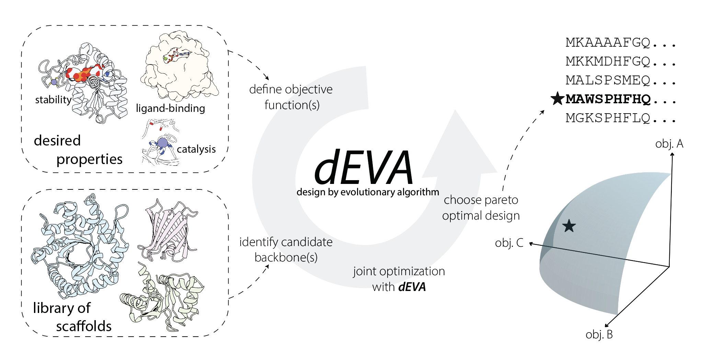

# dEVA: design by EVolutionary Algorithm



> [!NOTE]
> An updated version of dEVA is actively maintained at [gelnesr/dEVA](https://github.com/gelnesr/dEVA). If you have any issues, please report it there and will get back to you ASAP.

This work describes dEVA, first introduced in [Zero-shot design of a de novo metalloenzyme]([https://github.com/gelnesr/dEVA](https://www.biorxiv.org/content/10.64898/2026.04.23.720277v1)).

This guide explains how to add new objectives (scoring functions) to the dEVA protein design platform. While catered for structure-based protein design, in principle the code here can be modified for any multi-objective generation. 

## Overview

In dEVA, objectives are implemented as **models** that score protein designs. Each objective is a Python class that:
1. Inherits from `BaseModel`
2. Implements `setup()` and `score()` methods
3. Is registered with a unique name
4. Adds fitness values to individuals during evolution

## Step-by-Step Guide

### Step 1: Create Your Objective Class

Create a new Python file in the `models/` directory (e.g., `models/my_objective.py`). Your class must:

- Inherit from `BaseModel` (imported from `core.interfaces`)
- Be decorated with `@register_model("your_model_name")`
- Implement the required methods

**Template:**

```python
import os
from typing import Dict
from core.interfaces import BaseModel
from core.registry import register_model
from evolve.individual import Individual

@register_model("my_objective")
class MyObjective(BaseModel):
    def __init__(self):
        """
        Optional: Accept initialization parameters via command line if needed.
        Usually, parameters are configured in YAML (recommended).
        """
        self.param1 = kwargs.get('param1', default_value)
    
    def setup(self, config: Dict, device: str = 'cpu') -> None:
        """
        Initialize your model here.
        
        Args:
            config: Full configuration dictionary from the YAML file
            device: Device to run on ('cpu' or 'cuda')
        """
        self.config = config
        self.device = device
        
        # Access your model's config section from YAML
        self.model_config = self.config.models.my_objective
        
        # Extract parameters from config (with defaults if needed)
        self.param1 = self.model_config.get('param1', default_value)
        self.model_path = self.model_config.model_path  # required parameter
        
        # Set up output directories if needed
        outputs = self.config.general.outputs
        self.output_dir = os.path.join(outputs, "my_objective")
        os.makedirs(self.output_dir, exist_ok=True)
        
        # Load any required models, weights, or data files
        # Example: self.model = load_model(self.model_config.model_path)
    
    def score(self, individual: Individual):
        """
        Score an individual and add fitness values.
        
        Args:
            individual: The Individual object to score
            
        The individual object provides:
            - individual.get_name(): Path to the PDB file for this design
            - individual.get_index(): Index of this individual in the population
            - individual.get_gen(): Current generation number
            - individual.add_fitness(dict): Add fitness scores (dict of objective_name -> float)
        """
        # Get the PDB file path for this design
        pdb_path = individual.get_name()
        gen = individual.get_gen()
        index = individual.get_index()
        
        # Perform your scoring calculation
        # Example: score_value = calculate_score(pdb_path)
        
        # Add the fitness value(s) to the individual
        # The key(s) you use here will be the objective name(s) in the evolution
        individual.add_fitness({'my_objective': score_value})
        
        # Optional: Update the individual's PDB file if you modified it
        # individual.update_name(new_pdb_path)
```

### Step 2: Register Your Model

The `@register_model` decorator automatically registers your model when the module is imported. Since `models/__init__.py` auto-imports all modules in the `models/` directory, your model will be available once you create the file.

**Important:** The name you pass to `@register_model()` is what you'll use on the command line and in the YAML config.

### Step 3: Add Configuration to YAML

**This is the recommended way to configure your objective.** Add a configuration section for your model in your YAML config file under `models:`:

```yaml
models:
  my_objective:
    model_path: ./path/to/model.pt
    threshold: 0.5
    other_param: value
    weight: 1.0
```

Access these parameters in `setup()` via `self.config.models.my_objective`:

```python
def setup(self, config: Dict, device: str = 'cpu') -> None:
    self.config = config
    self.device = device
    
    # Access your model's config section
    self.model_config = self.config.models.my_objective
    self.threshold = self.model_config.threshold
    self.weight = self.model_config.get('weight', 1.0)  # with default
```

**Note:** You can also pass parameters via command line (e.g., `--models my_objective:{"param1":value1}`), but YAML configuration is preferred for reproducibility and easier management.

### Step 4: Use Your Objective

Run dEVA with your new objective:

```bash
python run.py --config configs/your_config.yml --models seq_model my_objective
```

**Important notes:**
- `seq_model` must always be listed first (it's required for sequence design)
- Additional objectives are evaluated in the order you list them
- Make sure your YAML config file includes the `models.my_objective` section with all required parameters
- You can also pass parameters via command line: `--models seq_model my_objective:{"param1":value1}`, but YAML configuration is preferred

## Key Concepts

### Individual Object

The `Individual` object represents a single protein design candidate. Key methods:

- `get_name()`: Returns the path to the PDB file for this design
- `get_index()`: Returns the index of this individual in the current generation
- `get_gen()`: Returns the current generation number
- `add_fitness(dict)`: Adds fitness scores (dict of `objective_name: float`)
- `update_name(path)`: Updates the PDB file path (if you create a modified version)

**Important:** You can only call `add_fitness()` once per objective per individual. If you need to add multiple fitness values, include them all in one call:

```python
individual.add_fitness({
    'objective1': value1,
    'objective2': value2
})
```

### Fitness Values

- Fitness values should be **floats**
- Higher values are considered better (for multi-objective optimization)
- The fitness keys you use in `add_fitness()` become the objective names in the evolution algorithm
- All individuals must have the same set of fitness keys

### Model Lifecycle

1. **Initialization**: `__init__()` is called when the model is instantiated (from command line args)
2. **Setup**: `setup()` is called once at the start of evolution for all models
3. **Scoring**: `score()` is called for each individual:
   - During initialization (when creating new individuals)
   - During mutation (when evolving existing individuals)

### Accessing Configuration

The `config` parameter in `setup()` is an OmegaConf object containing the full YAML configuration. **Your model's parameters should be defined in the YAML file under `models.your_model_name`** and accessed like:

```python
# Your model's settings (from YAML models section)
self.model_config = self.config.models.my_objective
my_param = self.model_config.my_param
my_param_with_default = self.model_config.get('optional_param', default_value)

# Other useful config values
output_dir = self.config.general.outputs
seed = self.config.general.seed
use_cuda = self.config.general.cuda
pdb_path = self.config.input.pdb
n_generations = self.config.evolution.n_generations
```

## Example: Complete Objective Implementation

Here's a complete example of a simple objective that calculates a score based on file size (for demonstration):

**1. Create the model file** (`models/file_size_score.py`):

```python
import os
from typing import Dict
from core.interfaces import BaseModel
from core.registry import register_model
from evolve.individual import Individual

@register_model("file_size_score")
class FileSizeScorer(BaseModel):
    def __init__(self):
        pass
    
    def setup(self, config: Dict, device: str = 'cpu') -> None:
        self.config = config
        self.device = device
        
        # Access configuration from YAML
        self.model_config = self.config.models.file_size_score
        self.weight = self.model_config.get('weight', 1.0)
        self.normalize = self.model_config.get('normalize', True)
    
    def score(self, individual: Individual):
        pdb_path = individual.get_name()
        
        # Calculate file size in KB
        if os.path.exists(pdb_path):
            file_size_kb = os.path.getsize(pdb_path) / 1024.0
            # Normalize or transform as needed
            score = file_size_kb * self.weight
            if self.normalize:
                score = score / 100.0  # Example normalization
        else:
            score = 0.0
        
        individual.add_fitness({'file_size': score})
```

**2. Add configuration to YAML** (`configs/evolution.yml`):

```yaml
models:
  file_size_score:
    weight: 0.1
    normalize: true
```

**3. Run with your objective:**

```bash
python run.py --config configs/evolution.yml --models seq_model file_size_score
```

**Alternative:** You can also pass parameters via command line (though YAML is preferred):
```bash
python run.py --config configs/evolution.yml --models seq_model file_size_score:{"weight":0.1}
```

## Troubleshooting

**"Unknown model 'my_objective'"**
- Make sure your file is in the `models/` directory
- Check that the `@register_model` decorator uses the exact name you're passing to `--models`
- Ensure the file doesn't start with `_` (those are ignored by auto-import)

**"Fitness for 'my_objective' already added"**
- You're calling `add_fitness()` multiple times for the same individual
- Combine all fitness values into a single `add_fitness()` call

**"Key for 'my_objective' is not in fitness_keys"**
- This shouldn't happen with `add_fitness()`, only with `update_fitness()`
- Use `add_fitness()` for new objectives

## See Also

- `models/metal3d_model.py`: Example of a complex objective with model loading
- `models/plip_score.py`: Example of a simpler scoring objective
- `core/interfaces.py`: Base class definition
- `core/registry.py`: Registration mechanism
- `evolve/individual.py`: Individual class implementation

# Citation

If you are using our code, datasets, or model, please use the following citation:
```bibtex
@article {ElNesr-2026,
    author = {El Nesr, Gina and Duerr, Simon L. and Mathews, Irimpan I. and Wen, Qi and Zhao, Kewei and Sarangi, Ritimukta and Roethlisberger, Ursula and Sunden, Fanny and Huang, Possu},
    title = {Zero-shot design of a de novo metalloenzyme},
    year = {2026},
    doi = {10.64898/2026.04.23.720277},
    journal = {bioRxiv}
}
```
